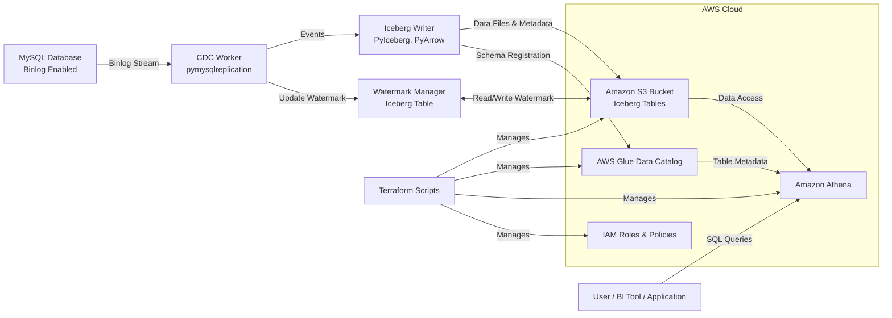

# MySQL CDC to Apache Iceberg

This project implements a robust Change Data Capture (CDC) pipeline, streaming data modifications in real-time from a MySQL database to Apache Iceberg tables stored in Amazon S3. It enables scalable data warehousing, analytics, and downstream processing by providing an efficient and reliable way to capture and store database changes.

<!-- Badges (Add these if/when CI/CD and licensing are formalized)
[](https://travis-ci.org/your_username/mysql-cdc-iceberg)
[](https://coveralls.io/github/your_username/mysql-cdc-iceberg?branch=main)
[](https://opensource.org/licenses/MIT)
-->

## Table of Contents
- [Overview](#overview)
- [Features](#features)
- [Architecture](#architecture)
  - [Diagram](#diagram)
- [Prerequisites](#prerequisites)
- [Quickstart](#quickstart)
  - [Using Docker Compose](#using-docker-compose)
  - [Running Locally](#running-locally)
- [Configuration](#configuration)
  - [Environment Variables](#environment-variables)
  - [PyIceberg Configuration](#pyiceberg-configuration)
- [Usage](#usage)
  - [Running CDC](#running-cdc)
  - [Running Backfill](#running-backfill)
  - [Adding New Tables for Replication](#adding-new-tables-for-replication)
- [Querying Data with Amazon Athena](#querying-data-with-amazon-athena)
  - [Setup](#setup)
  - [Example Queries](#example-queries)
- [Technical Details](#technical-details)
  - [Glue Catalog Namespace Structure](#glue-catalog-namespace-structure)
  - [Terraform and Table Creation](#terraform-and-table-creation)
  - [Watermark Management with Upsert Operations](#watermark-management-with-upsert-operations)
  - [Efficient Data Writing with PyArrow](#efficient-data-writing-with-pyarrow)
  - [JSON Serialization with Pydantic](#json-serialization-with-pydantic)
- [Development](#development)
  - [Project Structure](#project-structure)
- [Troubleshooting](#troubleshooting)
- [Contributing](#contributing)
- [License](#license)
- [FAQ](#faq)

---

## Overview
The MySQL CDC to Apache Iceberg pipeline captures row-level changes (inserts, updates, deletes) from MySQL binary logs (binlogs) using `pymysqlreplication`. These changes are then processed, batched, and written as Apache Iceberg tables to an Amazon S3 bucket. The system leverages AWS Glue Data Catalog for schema management and Amazon Athena for querying the Iceberg tables.

This solution is designed for scenarios requiring:
- **Data Lake Ingestion:** Efficiently moving operational data into a data lake.
- **Real-time Analytics:** Enabling analytics on near real-time data.
- **Auditing and Compliance:** Maintaining a historical record of data changes.
- **Decoupled Systems:** Allowing downstream applications to consume data changes without directly impacting the operational database.

## Features
- **Real-time Change Data Capture:** Captures MySQL binlog events.
- **Apache Iceberg Format:** Stores data in an open, efficient, and reliable table format on S3.
- **AWS Glue Integration:** Uses AWS Glue Data Catalog for schema management.
- **Amazon Athena Integration:** Enables SQL-based querying of Iceberg tables.
- **CDC and Backfill Modes:** Supports both ongoing replication and initial data loads.
- **Watermarking:** Tracks replication progress to ensure data consistency and enable resumability.
- **Configurable per Table:** Allows specifying which schema and table to replicate.
- **Batch Processing:** Efficiently writes data in batches using PyArrow.
- **Pydantic Validation:** Ensures data integrity and handles complex data types during serialization.
- **Terraform for IaC:** Infrastructure (S3, Glue, IAM, Athena) is managed using Terraform.
- **Dockerized Deployment:** Easy setup and deployment using Docker Compose.

## Architecture
The system comprises several key components:
1. **MySQL Database:** The source operational database with binlog enabled.
2. **CDC Worker (`cdc_worker.py`):** Reads and parses MySQL binlog events using `pymysqlreplication`.
3. **Iceberg Writer (`iceberg_writer.py`):** Formats events and writes them to Apache Iceberg tables in S3 using `PyIceberg` and `PyArrow`.
4. **Watermark Manager (`iceberg_watermark.py`):** Tracks the last processed binlog position for each table in a dedicated Iceberg table, enabling fault tolerance and resumability. Uses upsert operations for efficiency.
5. **Backfill Process (`backfill.py`):** Handles the initial full load of data from a MySQL table to an Iceberg table.
6. **Amazon S3:** Stores the Iceberg data files and metadata.
7. **AWS Glue Data Catalog:** Serves as the metastore for Iceberg tables, making them discoverable by query engines like Athena.
8. **Amazon Athena:** Allows querying the Iceberg tables using standard SQL.

### Diagram

**Diagram Explanation:**
- The CDC Worker reads binlog events from MySQL.
- Events are passed to the Iceberg Writer, which writes them as Iceberg tables to S3 and registers their schema in AWS Glue.
- The Watermark Manager keeps track of the replication progress, storing its state in an Iceberg table on S3.
- Users or applications can then query the data in S3 via Athena, which uses the Glue Data Catalog.
- Terraform manages the AWS infrastructure components.

## Prerequisites
- **Docker and Docker Compose:** For running the application and MySQL via Docker. (Recommended for local development)
- **Python 3.8+:** If running locally without Docker.
- **AWS Account:** With permissions to create and manage S3, Glue, IAM, and Athena resources.
- **AWS CLI:** Configured with credentials (or ensure environment variables `AWS_ACCESS_KEY_ID`, `AWS_SECRET_ACCESS_KEY`, and `AWS_REGION` are set).
- **MySQL Instance:** (Version 5.7+ or 8.0+) with binary logging enabled (`log_bin=ON`, `binlog_format=ROW`, `binlog_row_image=FULL`). The user connecting to MySQL must have `REPLICATION SLAVE`, `REPLICATION CLIENT`, and `SELECT` privileges.

## Quickstart

### Using Docker Compose (Recommended)
1.  **Clone the repository:**
    ```bash
    git clone <repository_url>
    cd mysql-cdc-iceberg
    ```
2.  **Copy and configure environment variables:**
    ```bash
    cp .env.example .env
    ```
    **Important:** Open `.env` and update `MYSQL_USER`, `MYSQL_PASSWD`, `AWS_ACCESS_KEY_ID`, `AWS_SECRET_ACCESS_KEY`, `AWS_REGION`, and `S3_BUCKET` with your actual credentials and desired S3 bucket name. Also, configure `CDC_SCHEMA` and `CDC_TABLE` for the table you want to replicate.
3.  **Deploy AWS Infrastructure with Terraform:**
    ```bash
    cd terraform
    terraform init
    terraform apply 
    cd ..
    ```
    Review the plan and type `yes` to apply. This will create the S3 bucket, Glue databases, IAM roles, and Athena workgroup.
4.  **Start the services:**
    ```bash
    docker-compose up --build -d
    ```
    This starts the CDC application and a MySQL container (if `MYSQL_HOST` in `.env` points to `db`).
5.  **Monitor logs:**
    ```bash
    docker-compose logs -f cdc
    ```
6.  **Initial Backfill (if needed for a new table):**
    Set `CDC_MODE=backfill` in your `.env` file and restart the CDC service:
    ```bash
    docker-compose restart cdc 
    ```
    Monitor logs. Once backfill is complete, set `CDC_MODE=cdc` and restart again to begin ongoing replication.

### Running Locally (Without Docker for the CDC service)
1.  **Clone the repository and navigate to the project directory.**
2.  **Create and activate a Python virtual environment:**
    ```bash
    python3 -m venv _cdc
    source _cdc/bin/activate
    pip install -r requirements.txt
    ```
3.  **Copy and configure environment variables:**
    ```bash
    cp .env.example .env
    ```
    Update `.env` as described in the Docker Compose section. Ensure `MYSQL_HOST` points to your accessible MySQL instance.
4.  **Deploy AWS Infrastructure with Terraform** (if not already done):
    ```bash
    cd terraform
    terraform init
    terraform apply
    cd ..
    ```
5.  **Ensure your MySQL instance is running, accessible, and binlogs are enabled.**
6.  **Run the application:**
    ```bash
    python -m cdc_service.main
    ```
    To run a backfill, set `CDC_MODE=backfill` in `.env` before running.

## Configuration

### Environment Variables
The application is configured using environment variables defined in the `.env` file.

| Variable                | Description                                                        | Default        | Required |
|-------------------------|--------------------------------------------------------------------|----------------|----------|
| `CDC_SCHEMA`            | MySQL schema to replicate                                          | `cdc_database` | Yes      |
| `CDC_TABLE`             | MySQL table to replicate                                           | `users`        | Yes      |
| `CDC_MODE`              | Operation mode: `cdc` (ongoing) or `backfill` (initial load)       | `cdc`          | Yes      |
| `CONNECTION_NAME`       | Identifier for S3 paths and Iceberg catalog (e.g., `my_db_prod`)   | `local_mysql`  | Yes      |
| `MYSQL_HOST`            | MySQL host address                                                 | `db` (Docker)  | Yes      |
| `MYSQL_PORT`            | MySQL port number                                                  | `3306`         | Yes      |
| `MYSQL_USER`            | MySQL username                                                     | `root`         | Yes      |
| `MYSQL_PASSWD`          | MySQL password                                                     | `password`     | Yes      |
| `AWS_REGION`            | AWS Region for S3, Glue, Athena                                    | `us-east-1`    | Yes      |
| `S3_BUCKET`             | S3 bucket name for Iceberg data (must be globally unique)          |                | Yes      |
| `AWS_ACCESS_KEY_ID`     | AWS Access Key ID (Alternatively, use IAM roles)                   |                | Yes*     |
| `AWS_SECRET_ACCESS_KEY` | AWS Secret Access Key (Alternatively, use IAM roles)                 |                | Yes*     |
| `AWS_PROFILE`           | AWS CLI profile to use (if not using key/secret directly)          | `default`      | No       |
| `BATCH_SIZE`            | Number of events to batch before writing to Iceberg                | `1000`         | No       |
| `CDC_SERVER_ID`         | Unique MySQL replication server ID (must be different for each CDC client connecting to the same MySQL instance) | `1`            | No       |
*Required if not running in an AWS environment with an assigned IAM role (e.g., EC2 instance profile).

### PyIceberg Configuration
PyIceberg configuration is primarily managed via the `.pyiceberg.yaml` file. This project's default configuration uses environment variable placeholders, which are resolved at runtime from the `.env` file or system environment.

Default `.pyiceberg.yaml`:
```yaml
catalog:
  default:
    type: glue
    # These will be replaced by environment variables:
    # AWS_REGION, AWS_ACCESS_KEY_ID, AWS_SECRET_ACCESS_KEY
    # If AWS_PROFILE is set in .env, it will be used by boto3 implicitly.
    # No need to specify glue.access-key-id or glue.secret-access-key if using AWS_PROFILE
    # or if running in an AWS environment with an IAM role.
    # PyIceberg/boto3 will automatically pick up credentials.
    glue.region: ${AWS_REGION} 
    # s3.access-key-id: ${AWS_ACCESS_KEY_ID} # Generally not needed if SDK can find credentials
    # s3.secret-access-key: ${AWS_SECRET_ACCESS_KEY} # Generally not needed
```
PyIceberg also supports overriding these settings via environment variables prefixed with `PYICEBERG_CATALOG__DEFAULT__`, e.g., `PYICEBERG_CATALOG__DEFAULT__GLUE__REGION=us-west-2`.

## Usage

### Running CDC
1. Set `CDC_MODE=cdc` in your `.env` file.
2. Start the application (using Docker Compose or locally).
3. The service will connect to MySQL, read the watermark for the configured table, and start streaming changes from the last recorded binlog position.
4. Events are batched and written to the corresponding Iceberg table in S3.
5. The watermark is updated after each successful batch write.

### Running Backfill
The backfill process performs an initial, full-table copy from MySQL to an Iceberg table.
1. Set `CDC_MODE=backfill` in your `.env` file.
2. Ensure the target Iceberg table either does not exist or you are okay with it being overwritten/appended to based on the backfill logic (current logic might create or replace).
3. Start the application.
4. The service will read all rows from the specified MySQL table and write them to the Iceberg table.
5. Once complete, the `backfill_complete` flag in the watermark table is set to `true`.
6. **Important:** After a successful backfill, switch `CDC_MODE` back to `cdc` and restart the service to begin capturing ongoing changes from the point the backfill completed.

### Adding New Tables for Replication
Currently, the service is designed to replicate one table per running instance, as defined by `CDC_SCHEMA` and `CDC_TABLE` in the `.env` file. To replicate multiple tables:
1.  **Option 1 (Multiple Instances):** Run multiple instances of the CDC service (e.g., separate Docker containers or processes), each with its own `.env` configuration pointing to a different table and a unique `CDC_SERVER_ID`.
2.  **Option 2 (Modify Code - Advanced):** Modify the application to manage multiple table streams within a single process. This would require significant changes to `main.py` and `cdc_worker.py` to handle multiple configurations, watermarks, and Iceberg writers.

For each new table:
- Ensure it's configured in a new `.env` file (if running multiple instances).
- Run a backfill (`CDC_MODE=backfill`) for the new table.
- Switch to `CDC_MODE=cdc` to start ongoing replication.

## Querying Data with Amazon Athena

### Setup
- The Terraform scripts (`terraform/athena.tf`) automatically create an Athena workgroup (e.g., `your-prefix-iceberg-workgroup`) and configure an S3 location for query results (`s3://{S3_BUCKET}/{CONNECTION_NAME}/athena-results/`).
- The Glue Data Catalog, populated by the CDC service, is used by Athena to find your Iceberg tables.
- Navigate to the Amazon Athena console in your AWS account.
- Select the correct AWS region.
- Choose the workgroup created by Terraform from the workgroup dropdown.
- Select the `iceberg_catalog` (or your Glue default catalog if tables are registered there) as the Data source, and your `CDC_SCHEMA` as the Database.

### Example Queries
Replace `${CDC_SCHEMA}` and `your_table_name` with your actual schema and table names.

- **List all tables in your data database:**
  ```sql
  SHOW TABLES IN ${CDC_SCHEMA};
  ```
- **List all tables in the metadata database:**
  ```sql
  SHOW TABLES IN cdc_metadata;
  ```
- **Preview data from a replicated table:**
  ```sql
  SELECT *
  FROM ${CDC_SCHEMA}.your_table_name
  LIMIT 10;
  ```
- **Count events by type for a specific table:**
  ```sql
  SELECT event_type, COUNT(*) as event_count
  FROM ${CDC_SCHEMA}.your_table_name
  GROUP BY event_type;
  ```
- **Get the latest 10 insert events:**
  ```sql
  SELECT *
  FROM ${CDC_SCHEMA}.your_table_name
  WHERE event_type = 'insert'
  ORDER BY timestamp DESC
  LIMIT 10;
  ```
- **Query data within a specific time range (Iceberg uses snapshot isolation):**
  ```sql
  SELECT *
  FROM ${CDC_SCHEMA}.your_table_name
  WHERE timestamp >= TIMESTAMP '2023-01-01 00:00:00' AND timestamp < TIMESTAMP '2023-01-02 00:00:00';
  ```
- **Check the latest watermark for a table:**
  ```sql
  SELECT *
  FROM cdc_metadata.watermarks
  WHERE "schema" = '${CDC_SCHEMA}' AND "table" = 'your_table_name' -- Note: "table" and "schema" might be reserved keywords
  ORDER BY updated_at DESC
  LIMIT 1;
  ```

## Technical Details

### Glue Catalog Namespace Structure
This project uses a direct mapping between MySQL and AWS Glue Data Catalog:
- **Data Tables:** MySQL schema name (`CDC_SCHEMA`) maps to a Glue database name. The MySQL table name (`CDC_TABLE`) maps to a Glue table name within that database. Example: MySQL table `my_db.orders` becomes Glue table `my_db.orders`.
- **Metadata Tables:** All metadata, specifically the `watermarks` table, is stored in a dedicated Glue database named `cdc_metadata`.
- **S3 Storage Structure:**
    - Data: `s3://{S3_BUCKET}/{CONNECTION_NAME}/{CDC_SCHEMA}/{CDC_TABLE}/`
    - Watermarks: `s3://{S3_BUCKET}/{CONNECTION_NAME}/watermarks/`

### Terraform and Table Creation
The Terraform configuration (`terraform/` directory) provisions:
- S3 bucket for Iceberg data and Athena results.
- AWS Glue databases (one for each `CDC_SCHEMA` and one for `cdc_metadata`).
- Necessary IAM roles and policies for Glue, S3, and Athena access.
- Athena workgroup and data catalog configuration.

**Important:** The Iceberg *tables themselves* (schema definition within Glue and metadata files in S3) are created by the Python application at runtime, not by Terraform. This ensures the Iceberg metadata (`metadata_location` property) is correctly initialized by PyIceberg.

### Watermark Management with Upsert Operations
The `IcebergWatermarkManager` uses an Iceberg table (`cdc_metadata.watermarks`) to store the last successfully processed binlog file and position for each replicated table.
- **Identifier Fields (Composite Key):** `connection_name`, `server_id`, `schema`, `table`.
- **Upsert Operations:** When updating a watermark, an upsert operation is performed. This atomically inserts a new watermark record or updates an existing one if the identifier fields match. This is more efficient and reliable than separate delete-then-insert operations.
- **Resumability:** If the CDC process stops and restarts, it reads the watermark to resume from where it left off, preventing data loss or duplicate processing.

### Efficient Data Writing with PyArrow
To optimize write performance to Iceberg tables:
- Events are collected into batches (`BATCH_SIZE`).
- Each batch is converted into a `pyarrow.Table`.
- The entire `pyarrow.Table` is appended to the Iceberg table in a single `tbl.append(arrow_table)` operation, leveraging PyIceberg's native Arrow integration for efficient columnar data writing.

### JSON Serialization with Pydantic
MySQL row data, which can contain various data types including `datetime`, `decimal`, etc., is stored as a JSON string in the `payload` column of the Iceberg table.
- **`CdcEvent` Pydantic Model:** Incoming events are validated and structured using this model.
- **`DateTimeEncoder`:** A custom `json.JSONEncoder` is used to ensure `datetime` objects (and potentially other complex types) are correctly serialized to ISO 8601 strings before being stored in the JSON payload. This prevents `TypeError: Object of type datetime is not JSON serializable`.

## Development

### Project Structure
-   `cdc_service/`: Main application Python modules.
    -   `main.py`: Application entry point, orchestrates CDC/backfill modes.
    -   `cdc_worker.py`: Core logic for connecting to MySQL, streaming binlog events, and batching them.
    -   `iceberg_writer.py`: Handles the creation of Iceberg tables and writing event batches to them using PyIceberg and PyArrow.
    -   `iceberg_watermark.py`: Manages reading and writing replication progress (watermarks) to a dedicated Iceberg table.
    -   `backfill.py`: Implements the logic for performing an initial full data load from a MySQL table to Iceberg.
-   `terraform/`: AWS infrastructure as code (IaC) using Terraform.
    -   `main.tf`: Core Terraform setup, provider configuration.
    -   `variables.tf`: Definitions of input variables used by the Terraform configuration.
    -   `outputs.tf`: Definitions of output values from Terraform (e.g., S3 bucket name, IAM role ARNs, Athena workgroup name).
    -   `s3.tf`, `glue.tf`, `iam.tf`, `athena.tf`: Terraform files defining specific AWS resources.
-   `Dockerfile`: Defines the Docker image for packaging the CDC application and its dependencies.
-   `docker-compose.yml`: Docker Compose configuration for setting up a local development environment, including the CDC application service and a MySQL service.
-   `.env.example`: An example template for the required environment variables.
-   `.pyiceberg.yaml`: Configuration file for the PyIceberg library, particularly for defining catalog properties.
-   `requirements.txt`: A list of Python dependencies for the project.
-   `README.md`: This file.

## Troubleshooting
| Symptom                                                       | Possible Cause(s)                                                                 | Solution(s)                                                                                                                                                             |
|---------------------------------------------------------------|-----------------------------------------------------------------------------------|-------------------------------------------------------------------------------------------------------------------------------------------------------------------------|
| `InvalidRegionError` / AWS Region Mismatch                    | `AWS_REGION` env var not set/incorrect. `.pyiceberg.yaml` misconfigured.          | Ensure `AWS_REGION` is correctly set in `.env`. Verify `.pyiceberg.yaml` or `PYICEBERG_` env vars if overriding.                                                        |
| Iceberg table not found / Catalog issues / Access Denied      | AWS credentials error (keys/profile/role). Glue DB/Table not created by app. S3/Glue permissions. | Check AWS credentials in `.env` or IAM role. Ensure app created the table in Glue. Verify IAM role permissions for S3 (read/write bucket & objects) and Glue (CRUD operations). |
| `TypeError: Object of type datetime is not JSON serializable` | Datetime object in payload not handled by `json.dumps`.                           | The `DateTimeEncoder` used with Pydantic in `iceberg_writer.py` should handle this. Ensure event data passed to `CdcEvent` is correct.                                   |
| CDC worker stuck, in a loop, or processing duplicates       | Watermark logic issue. Incorrect `CDC_SERVER_ID`. Binlog parsing error. Network issues. | Check logs from `cdc_worker` and `iceberg_watermark`. Ensure `CDC_SERVER_ID` is unique per MySQL master. Verify MySQL binlog settings. Check network connectivity to MySQL. |
| Athena query fails / Table not found in Athena                | Glue database/table not created or accessible. Athena workgroup misconfigured. IAM Permissions. | Ensure tables are created by the app and visible in Glue console. Check Athena workgroup settings (S3 output location, engine version). Verify Athena/Glue IAM permissions. |
| Backfill fails or doesn't load all data                     | MySQL connection issue. Insufficient MySQL user permissions. Large table timeouts.  | Check MySQL connectivity and user privileges (`SELECT` on table). For very large tables, consider increasing timeouts or batching if applicable (current backfill is basic). |
| `pymysqlreplication.err.BinLogNotEnabledError`                | Binary logging is not enabled on the MySQL server.                                | Enable binary logging on MySQL: set `log_bin=ON`, `binlog_format=ROW`, `binlog_row_image=FULL` in `my.cnf` and restart MySQL.                                       |

## Contributing
We welcome contributions! Please follow these guidelines:
-   **Reporting Issues:** Use the GitHub issue tracker for the repository. Provide detailed steps to reproduce, relevant logs, and environment information (OS, Python version, Docker version, etc.).
-   **Feature Requests:** Submit an issue detailing the proposed feature, its use case, and potential benefits.
-   **Pull Requests:**
    1.  Fork the repository.
    2.  Create a new branch for your feature or bug fix (e.g., `feature/new-thing` or `fix/issue-123`).
    3.  Make your changes, adhering to existing code style and conventions (e.g., PEP 8 for Python).
    4.  Add unit tests for new functionality or bug fixes.
    5.  Ensure all tests pass.
    6.  Update documentation (README.md, docstrings) if your changes affect usage, configuration, or architecture.
    7.  Submit a Pull Request (PR) to the `main` branch (or the appropriate development branch). Provide a clear description of your changes in the PR.

## License
This project is licensed under the MIT License. See the `LICENSE` file (if one exists, otherwise assume MIT or specify) for details.

## FAQ
-   **Q: How does the backfill process work?**
    A: When `CDC_MODE=backfill`, the `backfill.py` script connects to the source MySQL table, reads all existing rows in chunks (if implemented, current might be basic), converts them to the Iceberg event format, and writes them to the target Iceberg table. It then updates the watermark to indicate backfill completion.
-   **Q: Can I replicate multiple tables simultaneously with one instance?**
    A: Currently, the application is designed to replicate one table per running instance, defined by `CDC_SCHEMA` and `CDC_TABLE`. To replicate multiple tables, you would run multiple instances of the CDC service, each configured for a different table and using a unique `CDC_SERVER_ID`. Modifying the core application to handle multiple table streams in a single process would be a significant enhancement.
-   **Q: What are the performance considerations?**
    A: Performance depends on several factors:
    -   **MySQL Load & Binlog Volume:** Higher transaction rates on the source MySQL will generate more binlog events.
    -   **Network Latency:** Between the CDC service, MySQL, and AWS services (S3, Glue).
    -   **`BATCH_SIZE`:** Larger batches can be more efficient for S3 writes but increase memory usage and latency for individual events to appear in Iceberg.
    -   **Instance Resources:** CPU and memory allocated to the CDC service container/instance.
    -   **S3 Performance:** Standard S3 performance characteristics apply.
    -   **PyIceberg/PyArrow Efficiency:** These libraries are generally efficient for columnar data.
-   **Q: How is schema evolution handled?**
    A: Basic schema evolution (e.g., adding nullable columns) in the source MySQL table might be handled gracefully if the Iceberg table schema is compatible or updated. However, complex schema changes (renaming/dropping columns, changing data types) are not automatically handled by this pipeline and would require manual intervention or a more sophisticated schema evolution strategy (e.g., recreating the Iceberg table after backfill, or using Iceberg's schema evolution features carefully). The current Iceberg table schema is fixed upon creation.
-   **Q: What happens if the CDC service crashes?**
    A: Thanks to the watermarking system, if the service crashes and restarts, it will read the last successfully committed watermark from the `cdc_metadata.watermarks` Iceberg table and resume processing binlog events from that point, minimizing data loss and preventing reprocessing of already committed data.
